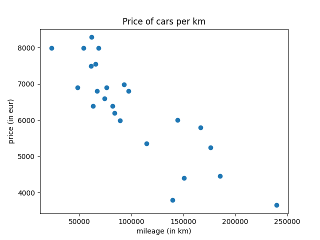
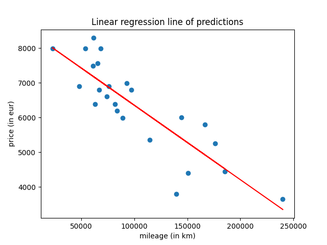

# ft_linear_regression
### My first machine learning algorithm !


## What is linear_regression ?

Linear regression is a statistical model which estimates the linear relationship between
a scalar and one or more variables (in this project we implement a linear regression with 1 variable)

## Objective

The aim of this project is to introduce you to the basic concept behind machine learning.
For this project, you will have to create a program that predicts the price of a car by
using a [linear function](https://en.wikipedia.org/wiki/Linear_function) train with a [gradient descent](https://en.wikipedia.org/wiki/Gradient_descent) algorithm.

## How to use ?

### Prerequites:

- pandas
- numpy
- matplotlib ( for graphs features only)

You can install all dependencies by running ``poetry install`` otherwise ```pip install -r requirements.txt``` also work

### Training model

First you need to train your model.  
There are a data.csv file in dataset folder who is gonna be used to train the model

to train your model run: ``python3 src/train.py``  
You can also run it with verbose mode: ``python3 src/train.py -v (or --verbose)``

if all goes well the program will prompt you with the [RMSE](https://statisticsbyjim.com/regression/root-mean-square-error-rmse/) of the model and it create a thetas.csv file in dataset folder containing the bias and weight for our linear_function: ```f(mileage) = theta0 + (theta1 * mileage)```


### Predicts

When you got your trained model you can just run ``python3 src/predict.py`` and the program will prompt you for a mileage then he gonna predict you a price based on the mileage you entered

## Data visualisation

The fun part ! You can run ```python3 src/data_visualisation.py``` a program gonna ask you which graph do you want do see.  




